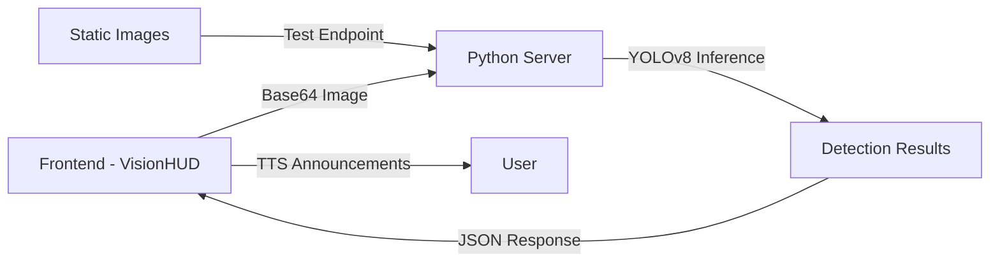

# NEXORA Object Detection Guide

## Overview

NEXORA features advanced real-time object detection powered by YOLOv8, enabling the AI assistant to "see" and identify objects through your camera. This guide covers setup, usage, and troubleshooting.

## Architecture



## Features

- **Real-time Detection**: 2 FPS object detection from camera feed
- **80 Object Classes**: Detects people, vehicles, animals, household items, and more
- **HUD Interface**: Futuristic overlay with bounding boxes and labels
- **Voice Announcements**: TTS feedback for detected objects
- **High Accuracy**: YOLOv8 Medium model with excellent precision

## Setup

### Prerequisites

- Python 3.8+
- Node.js 16+
- Modern browser with camera support
- Webcam or camera device

### Installation

1. **Install Python Dependencies**
   ```bash
   cd python_server
   pip install -r requirements.txt
   ```

2. **Install Node Dependencies**
   ```bash
   npm install
   ```

3. **Verify Model Files**
   The YOLOv8 models are included:
   - `yolov8m.pt` - Medium model (52MB, better accuracy) ✅ Currently active
   - `yolov8n.pt` - Nano model (6.5MB, faster inference)

## Usage

### Starting the Servers

1. **Start Python Vision Server** (Terminal 1)
   ```bash
   cd python_server
   python app.py
   ```
   Expected output:
   ```
   🚀 NEXORA Vision Core Starting on port 5001
   📦 Model: YOLOv8 Medium (yolov8m.pt)
   🎯 Classes: 80 object types
   ✅ Ready for detection requests
   ```

2. **Start Node.js Backend** (Terminal 2)
   ```bash
   npm run server
   ```

3. **Start Frontend** (Terminal 3)
   ```bash
   npm run dev
   ```

### Using Vision Mode

1. Login to NEXORA
2. Click the **Camera icon** in the chat interface
3. Grant camera permissions when prompted
4. The VisionHUD will activate showing:
   - Live camera feed
   - Real-time object detection overlays
   - Confidence scores for each detection
   - System status indicators

5. Objects will be announced via text-to-speech
6. Click the **X button** or "TERMINATE VISUAL LINK" to exit

## API Endpoints

### POST /detect
Real-time detection from base64 encoded image.

**Request:**
```json
{
  "image": "data:image/jpeg;base64,/9j/4AAQSkZJRg..."
}
```

**Response:**
```json
{
  "detections": [
    {
      "bbox": [100, 150, 300, 400],
      "confidence": 0.92,
      "label": "person"
    }
  ]
}
```

### GET /health
Check server status.

**Response:**
```json
{
  "status": "active",
  "model": "yolov8m"
}
```

### GET /model-info
Get detailed model information.

**Response:**
```json
{
  "model_name": "YOLOv8 Medium",
  "model_file": "yolov8m.pt",
  "framework": "Ultralytics YOLO",
  "num_classes": 80,
  "class_names": ["person", "bicycle", "car", ...],
  "input_size": "640x640",
  "status": "loaded"
}
```

### POST /test-image
Test detection on server-side image.

**Request:**
```json
{
  "image_path": "../object-detection-opencv-master/dog.jpg"
}
```

**Response:**
```json
{
  "detections": [...],
  "image_path": "../object-detection-opencv-master/dog.jpg",
  "image_size": {"width": 1280, "height": 720},
  "num_detections": 3
}
```

## Testing

### Automated Testing

Run the test suite:
```bash
cd python_server
python test_detection.py
```

This will:
- ✅ Test health endpoint
- ✅ Test model info endpoint
- ✅ Run detection on sample images
- ✅ Generate annotated output images in `test_output/`

### Manual Testing

Test with curl:
```bash
# Health check
curl http://localhost:5001/health

# Model info
curl http://localhost:5001/model-info

# Test image
curl -X POST http://localhost:5001/test-image \
  -H "Content-Type: application/json" \
  -d '{"image_path": "../object-detection-opencv-master/dog.jpg"}'
```

## Detected Object Classes

YOLOv8 can detect 80 different object types from the COCO dataset:

**People & Animals**: person, bird, cat, dog, horse, sheep, cow, elephant, bear, zebra, giraffe

**Vehicles**: bicycle, car, motorcycle, airplane, bus, train, truck, boat

**Indoor Objects**: chair, couch, bed, dining table, toilet, tv, laptop, mouse, keyboard, cell phone, microwave, oven, toaster, sink, refrigerator, book, clock, vase

**Outdoor Objects**: traffic light, fire hydrant, stop sign, parking meter, bench

**Sports & Recreation**: frisbee, skis, snowboard, sports ball, kite, baseball bat, baseball glove, skateboard, surfboard, tennis racket

**Food & Drink**: bottle, wine glass, cup, fork, knife, spoon, bowl, banana, apple, sandwich, orange, broccoli, carrot, hot dog, pizza, donut, cake

**Accessories**: backpack, umbrella, handbag, tie, suitcase

**Other**: scissors, teddy bear, hair drier, toothbrush, potted plant, remote

## Performance Optimization

### Switching to Faster Model

For better performance on slower hardware, switch to the nano model:

1. Edit `python_server/app.py` line 15:
   ```python
   model = YOLO('yolov8n.pt')  # Changed from yolov8m.pt
   ```

2. Restart the Python server

**Trade-offs:**
- YOLOv8n: Faster (3-4 FPS), lower accuracy
- YOLOv8m: Slower (1-2 FPS), higher accuracy

### Adjusting Detection Frequency

Edit `src/components/VisionHUD.jsx` line 22:
```javascript
const interval = setInterval(captureAndDetect, 500); // Change 500 to 1000 for slower detection
```

## Troubleshooting

### Camera Not Working

**Issue**: "Could not access camera"

**Solutions:**
- Grant camera permissions in browser
- Ensure no other app is using the camera
- Use HTTPS or localhost (required for camera access)
- Check browser compatibility (Chrome/Edge recommended)

### Python Server Errors

**Issue**: "Module not found" errors

**Solution:**
```bash
cd python_server
pip install -r requirements.txt
```

**Issue**: Model file not found

**Solution:**
The models will auto-download on first run. Ensure internet connection.

### Detection Not Working

**Issue**: No objects detected

**Checks:**
1. Python server running on port 5001
2. Check browser console for errors
3. Verify camera feed is visible
4. Test with `/test-image` endpoint first

**Issue**: CORS errors

**Solution:**
Ensure Flask-CORS is installed and Python server shows CORS headers in logs.

### Performance Issues

**Issue**: Low FPS or laggy detection

**Solutions:**
- Switch to YOLOv8n (nano model)
- Increase detection interval (reduce frequency)
- Close other resource-intensive applications
- Use a device with GPU support

## YOLOv3 vs YOLOv8

The project includes two YOLO implementations:

| Feature | YOLOv3 (OpenCV) | YOLOv8 (Ultralytics) |
|---------|-----------------|----------------------|
| Location | `object-detection-opencv-master/` | `python_server/` |
| Framework | OpenCV DNN | Ultralytics |
| Model Size | 237 MB | 6.5-52 MB |
| Usage | Static images (CLI) | Real-time API |
| Status | Reference/Legacy | **Active** ✅ |

**Recommendation**: Use YOLOv8 for all new development. YOLOv3 is kept for reference.

## Advanced Configuration

### Custom Confidence Threshold

Edit `python_server/app.py` to add confidence filtering:
```python
# In the detect() function, after line 47
detections = []
for r in results:
    boxes = r.boxes
    for box in boxes:
        conf = float(box.conf[0])
        if conf < 0.5:  # Add this line - skip low confidence
            continue
        # ... rest of the code
```

### Custom Classes

To detect only specific objects, filter by class name:
```python
allowed_classes = ['person', 'car', 'dog', 'cat']
if label not in allowed_classes:
    continue
```

## Resources

- [YOLOv8 Documentation](https://docs.ultralytics.com/)
- [COCO Dataset](https://cocodataset.org/)
- [OpenCV Documentation](https://docs.opencv.org/)

## Support

For issues or questions:
1. Check the troubleshooting section above
2. Review browser console and Python server logs
3. Test with the automated test suite
4. Verify all dependencies are installed
